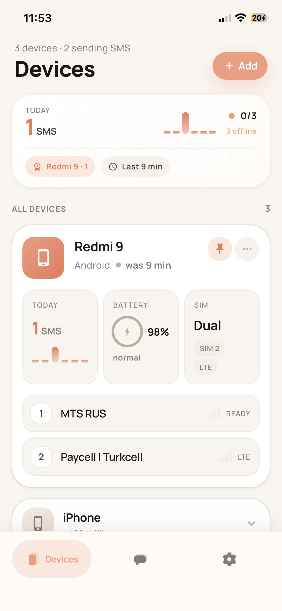
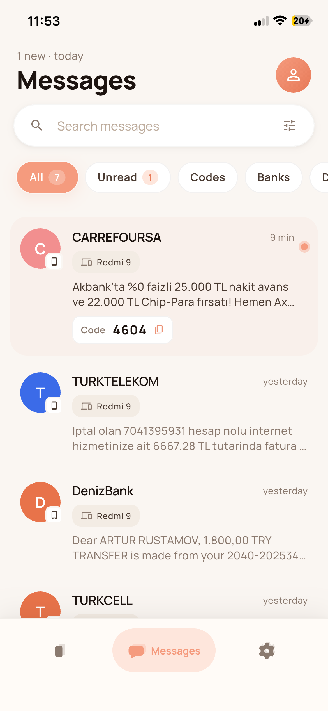
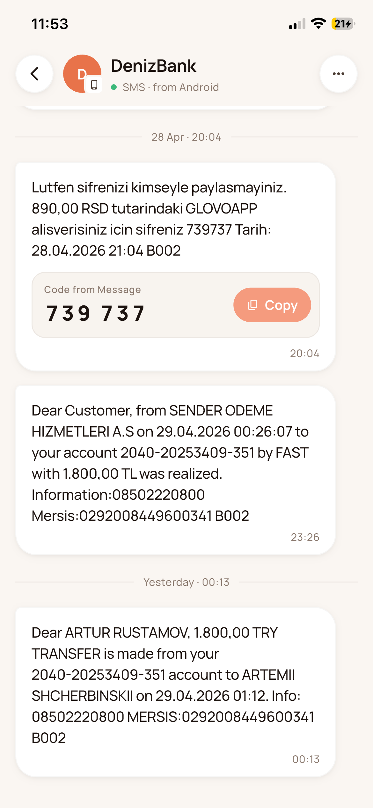
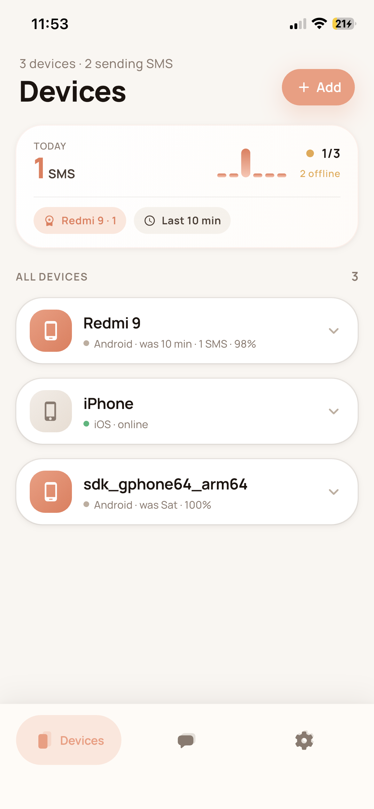
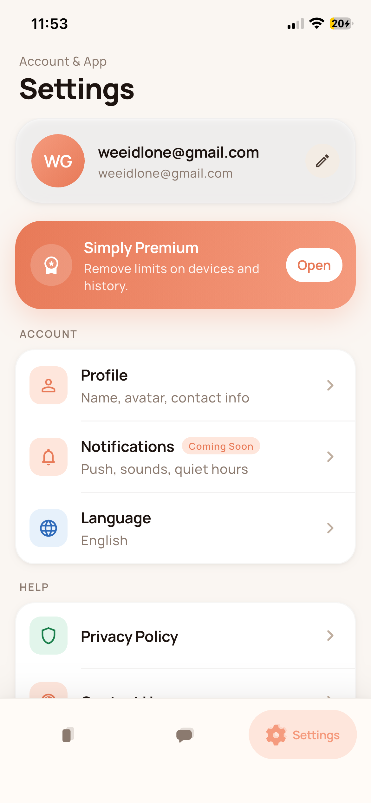

<div align="center">

# Simply

### Cross-device SMS forwarding, beautifully done.

**Read your Android SMS — including OTP / 2FA codes — live on your iPhone.**

[](https://flutter.dev)
[](https://dart.dev)
[](https://firebase.google.com)
[](#platforms)
[](#project-status)
[](#localization)

</div>

---

## What is Simply?

**Simply** is a Flutter app that **forwards incoming SMS from one Android phone to all your other devices** — Android or iOS — in real time, through Firebase Firestore.

The classic use case: keep a work Android as a SIM-bound OTP receiver, and read the codes the moment they arrive on your personal iPhone. Sign in once on each device, designate the Android as the **Main Device**, and every incoming SMS is intercepted, end-to-end encrypted, stored in Firestore, and pushed live to every other device on the same account.

> **TL;DR** — Sign in everywhere. SMS arrives on the SIM phone. You read it on whichever phone is in your hand.

---

## Screenshots

<div align="center">

<table>
  <tr>
    <td align="center"><b>Devices</b></td>
    <td align="center"><b>Messages</b></td>
    <td align="center"><b>Conversation</b></td>
  </tr>
  <tr>
    <td></td>
    <td></td>
    <td></td>
  </tr>
  <tr>
    <td align="center"><b>All Devices</b></td>
    <td align="center"><b>Settings</b></td>
    <td align="center"><b>—</b></td>
  </tr>
  <tr>
    <td></td>
    <td></td>
    <td></td>
  </tr>
</table>

</div>

### A quick walkthrough

| Screen | What you see |
|---|---|
| **Devices** | A live overview of every phone signed into your account — main device on top with a daily SMS counter, battery, signal type and SIM info. Offline phones fade out gracefully. |
| **Messages** | A clean, searchable feed of all forwarded SMS, grouped by sender. Filter chips for **Unread**, **Codes**, **Banks**, **Delivery**. Detected OTP codes get a one-tap copy chip right inline. |
| **Conversation** | Full thread for a single sender, with date dividers and the trademark **auto-detected code block** — big, mono-spaced, single-tap copy. |
| **All Devices** | Compact list view: at a glance see which phones are online, when they were last seen, and switch which one acts as the SMS sender. |
| **Settings** | Account card with avatar initials, **Simply Premium** banner, language selector (EN / RU), Privacy Policy and Contact Us. |

---

## Features

### Core
- **Background SMS interception** on Android via `another_telephony` + foreground-service notification.
- **Real-time sync** between devices through Firestore `snapshots()` — no polling, no FCM lag.
- **End-to-end encryption** of message bodies (AES-GCM) with the master key kept in `flutter_secure_storage`.
- **Stable per-device identity** — `deviceId` survives reinstalls and OS upgrades (lives in secure storage, not `Build.ID`).
- **Auto OTP detection** — heuristic cue-word + regex extractor surfaces 4–8 digit codes and lets you copy with a single tap. Doesn't false-positive on order numbers or amounts.
- **Live read state** — opening a chat marks it read everywhere; the other devices get the update through the same Firestore stream.

### UX
- **Warm coral design language** — single palette, single font (`Manrope`), single set of design tokens (`AppColor`, `AppTextStyle`, `AppRadii`, `AppShadows`).
- **Floating pill bottom navigation** — active tab inflates to show its label.
- **Pull-to-refresh** on every list, optimistic state, friendly empty states.
- **Bilingual UI** — English and Russian, switchable from Settings, persisted across launches.
- **Letter avatars** with stable per-name color from an 8-color palette.

### Auth & Account
- Email + password sign-in / sign-up via Firebase Auth.
- Password reset via email link.
- Human-readable error messages (mapped from `FirebaseAuthException.code`, no raw stack traces).

---

## Platforms

| Platform | SMS interception | Receive forwarded SMS | Notes |
|---|:---:|:---:|---|
| **Android** | ✅ | ✅ | The "sender" role. Needs `RECEIVE_SMS`, `READ_SMS`, `POST_NOTIFICATIONS`. Foreground service stays alive while listening. |
| **iOS** | ❌ | ✅ | iOS doesn't expose SMS to apps, period. Use as a receiver-only client paired with an Android phone. |

---

## Tech stack

<div align="center">

| Layer | Tooling |
|---|---|
| **Framework** | Flutter 3.24 · Dart 3.5 |
| **State** | `flutter_bloc` (Cubit pattern, one cubit per screen) |
| **Backend** | Firebase Auth · Cloud Firestore · Firebase Messaging |
| **Native (Android)** | `another_telephony` · `flutter_local_notifications` · `permission_handler` · `battery_plus` · `device_info_plus` |
| **Security** | `cryptography` (AES-GCM) · `flutter_secure_storage` |
| **Design system** | Manrope font · custom `AppColor` / `AppTextStyle` / `AppRadii` / `AppShadows` tokens · `warm/*` widget primitives |
| **i18n** | `flutter_localizations` · `intl` · ARB-driven `flutter gen-l10n` |
| **Build (Android)** | Gradle 8.7 · AGP 8.6.0 · Kotlin 2.1.0 · Java 17 |

</div>

---

## Architecture at a glance

```
lib/
├── main.dart                — bootstrap (Firebase, intl, locale, theme)
├── extensions.dart          — date formatters (relativeShort, chatDivider, time)
├── bloc/
│   ├── locale/              — LocaleCubit + LocaleState (live language switching)
│   └── notification/        — background SMS isolate handler
├── models/                  — Device · Conversation · Message · PaginatedResponse
├── repositories/            — FirebaseApi · MessagesRepository · DeviceRepository
├── security/                — CryptoService · KeyEnvelope · MessagesCodec · SecureStorageService
├── themes/                  — colors · text_style · radii · shadows
├── l10n/                    — app_en.arb · app_ru.arb (+ generated delegates)
├── utils/code_extractor.dart — OTP heuristic
└── screens/
    ├── splash/              — auth-state-driven redirect
    ├── auth/                — login · register · forgot-password
    ├── home/                — IndexedStack + PillTabBar + FcmCubit
    ├── messages_list/       — search · filter chips · inline code chips
    ├── message_details/     — date dividers + auto code blocks
    ├── devices/             — stats grid · settings modal
    ├── settings/            — profile · premium · language · help
    ├── language_selection/  — EN / RU picker with live apply
    ├── privacy_policy/
    ├── contact_us/
    └── widget/warm/         — design primitives (WarmHeader · WarmChip · WarmCard · PillTabBar · IconTile · WarmSearchField)
```

### Firestore data model

```
devices/{userId}/items/{deviceId}
    user_id, device_name, device_id, is_main_device,
    battery_level, network_type, date_update_info, platform, token

user_messages/{userId}/
    messages/{address}                    ← conversation preview
        id, title, last_message,
        last_message_date, unread_messages_count, createdAt

    message/items/{address}/{autoId}      ← individual messages
        text (AES-GCM ciphertext), date
```

Conversations and devices are owner-scoped — see [`firestore.rules`](./firestore.rules) for the baseline security rules.

---

## Localization

Simply ships with **English** and **Russian** out of the box. Language is detected from the system locale on first launch, persisted in secure storage, and changes live the moment you switch — no restart, no flicker.

Adding a new language is two files and a regen:

```bash
# 1. Copy the keys from app_en.arb into a new ARB
cp lib/l10n/app_en.arb lib/l10n/app_de.arb   # then translate values

# 2. Regenerate the typed delegate
flutter gen-l10n

# 3. Add Locale('de') to supportedLocales in main.dart
#    and a card in language_selection_screen.dart
```

Full guide: [`L10N_SETUP.md`](./L10N_SETUP.md).

---

## Quick start

```bash
# 1. Install dependencies
flutter pub get

# 2. Drop in your own Firebase config
#    android/app/google-services.json
#    ios/Runner/GoogleService-Info.plist

# 3. Generate localization delegates
flutter gen-l10n

# 4. Run
flutter run
```

**Minimum SDKs:** Flutter 3.24 · Dart 3.5

### Firebase project setup

You will need a Firebase project with:

- **Authentication** — Email/Password provider enabled.
- **Cloud Firestore** — in *production* mode, then deploy [`firestore.rules`](./firestore.rules):
  ```bash
  firebase deploy --only firestore:rules
  ```
- **Cloud Messaging** — initialized; not strictly required for delivery (Firestore streams handle that), but good to have for future push-driven flows.

### Android permissions

The Android side requests the following at runtime (see `HomePage._requestPermissions`):

- `android.permission.RECEIVE_SMS`
- `android.permission.READ_SMS`
- `android.permission.POST_NOTIFICATIONS` (Android 13+)

A persistent foreground-service notification is shown while the listener is active — required by Google Play policy for background SMS access.

---

## Documentation

In-depth docs live in [`docs/`](./docs/README.md):

| Doc | Topic |
|---|---|
| [`01_PRODUCT_OVERVIEW.md`](./docs/01_PRODUCT_OVERVIEW.md) | Product purpose, feature matrix, target users |
| [`02_SCREENS_OVERVIEW.md`](./docs/02_SCREENS_OVERVIEW.md) | Screen-by-screen breakdown of UI and logic |
| [`03_BUGS_AND_ISSUES.md`](./docs/03_BUGS_AND_ISSUES.md) | Known bugs, edge cases |
| [`04_SECURITY_AUDIT.md`](./docs/04_SECURITY_AUDIT.md) | Threat model, encryption, Firestore rules |
| [`05_ARCHITECTURE_IMPROVEMENTS.md`](./docs/05_ARCHITECTURE_IMPROVEMENTS.md) | Refactor roadmap |
| [`06_FIX_PROGRESS.md`](./docs/06_FIX_PROGRESS.md) | What's already shipped |
| [`07_EXECUTION_PLAN.md`](./docs/07_EXECUTION_PLAN.md) | Active milestones |
| [`L10N_SETUP.md`](./L10N_SETUP.md) | Localization guide |

---

## Project status

**MVP / alpha.** Core forwarding loop, encryption, multi-device sync, and the warm-coral design system are in place and stable. Things that are intentionally still rough:

- Privacy Policy screen is a placeholder — store-publication blocker.
- Google / Apple sign-in buttons are wired into the UI but not yet implemented.
- Release builds are still signed with debug keys (irrelevant for personal use, blocking for store).
- No CI/CD; `test/` covers `security/` only.

See [`03_BUGS_AND_ISSUES.md`](./docs/03_BUGS_AND_ISSUES.md) and [`06_FIX_PROGRESS.md`](./docs/06_FIX_PROGRESS.md) for the live picture.

---

## Contributing

Please skim [`05_ARCHITECTURE_IMPROVEMENTS.md`](./docs/05_ARCHITECTURE_IMPROVEMENTS.md) before opening a large PR — there's an ordered refactor plan and most "obvious cleanups" are already on the roadmap.

When adding UI:

- Reuse `lib/screens/widget/warm/*` primitives — don't introduce new card or chip widgets.
- Reach for `AppColor` / `AppTextStyle` / `AppRadii` / `AppShadows` tokens, never raw hex or magic numbers.
- Wrap any user-facing string with `AppLocalizations.of(context)!.…` and add the key to **both** `app_en.arb` and `app_ru.arb`.

---

## Contact

- **Email** — [weeidlone@gmail.com](mailto:weeidlone@gmail.com)
- **Web** — [weeidl.com](https://weeidl.com)
- **Instagram** — [@weeidl](https://www.instagram.com/weeidl)

<div align="center">

Built with care by the **Simply** team.

</div>
